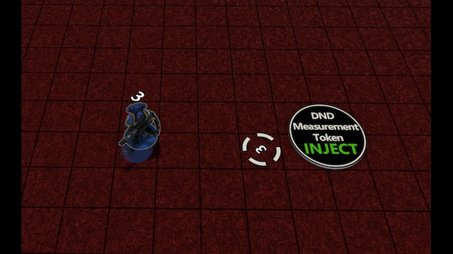

# Miniature Script Injector

Ever wished your miniatures in **Tabletop Simulator** could automatically track movement distances?  
This mod adds exactly that – a simple drag-and-drop way to give any minis a measurement tool!

---

## 🎮 Features

- **Drag & Drop Injection** – Drop a miniature onto the panel to automatically add the distance-measuring script.
- **Automatic Distance Display** – When you move your mini, it shows how far you've moved on the tabletop grid.
- **Visual Measurement Token** – A temporary spinning marker appears to show starting position while moving.
- **Clean & Lightweight** – The measurement marker automatically deletes itself after a short time.
- **Easy Script Removal** – Flip the panel upside down and drop a miniature to remove the script instantly.
- **Safe Injection** – Won’t overwrite custom scripts unless they're part of this system.
- **Supports Miniatures** – Works with objects tagged as *Miniature, Figurine, Figure,* or *Model*.

---

## 📝 How to Use

1. Place the **Panel** on your table.
2. Drop a miniature onto the panel:
    - **Right-side up** → Adds the distance script.
    - **Upside down** → Removes the script.
3. Pick up and move your miniature – the distance counter will appear automatically!

---

## 🙌 Credits & Thanks

**Built with passion, assets and inspiration came from the following mods:**

- [DnD Tools (Mini Injector/Initiative Tracking/Wall Spawner/Grid Management) by ColColonCleaner](https://steamcommunity.com/sharedfiles/filedetails/?id=2454472719)

A big **thank you** for the amazing tools – without these contributions, this mod wouldn't exist.

---

## 📚 Resources

- [Assets and a copy of the savegame on GitHub](https://github.com/cornernote/tabletop_simulator-miniature_movement_injector)
- [Game on Tabletop Simulator Steam Workshop](https://steamcommunity.com/sharedfiles/filedetails/?id=3558729769)

---
